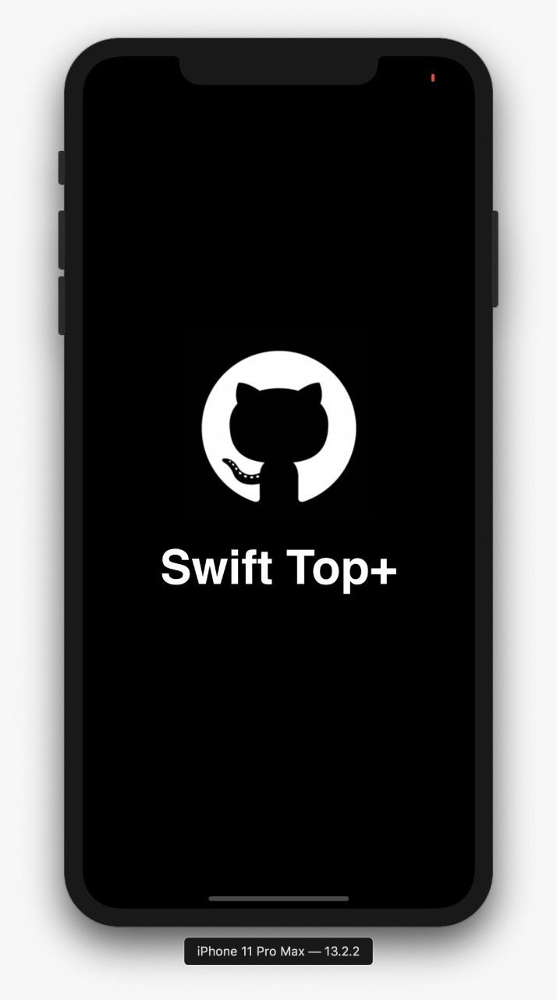
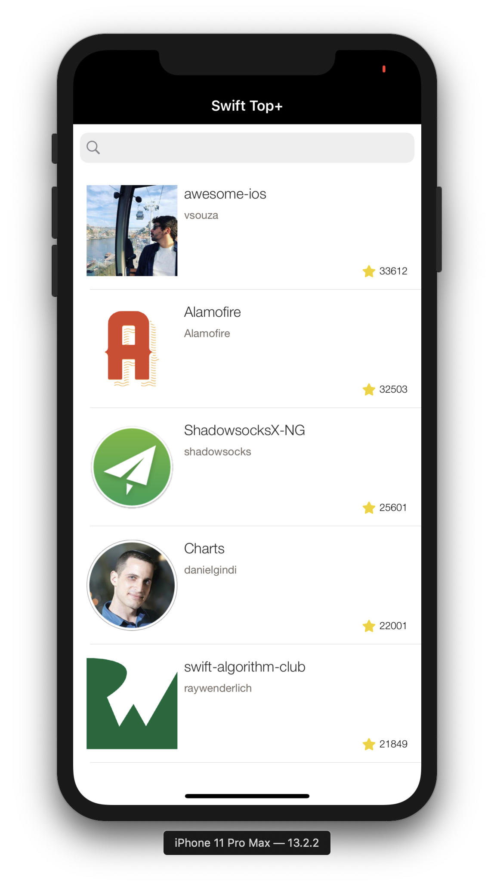

# GithubTopSwift

App iOS para listar os repositórios com mais estrelas em Swift, utilizando RxSwift e MVVM

## Introdução

Esse projeto tem como finalidade buscar os repositórios do github que contém mais estrelas (espero um dia estar lá) e filtrá-los na tela.
Nessa tela contém um campo de busca e também é possível usar swipe refresh para atualizar.
Abaixo, vou explicar como rodar esse projeto na sua máquina.

### Pré-requisitos

Esse projeto iOS foi utilizado bibliotecas externas com **cocoapods**, então certifique-se que tenha instalado ou instale [nesse link.](https://guides.cocoapods.org/using/getting-started.html)

|                       Splash Screen                       |              Home Screen              |
| :-------------------------------------------------------: | :-----------------------------------: |
|  |  |

### Instalação

Para rodar o projeto, dê um pod install para instalar todas as dependências do projeto, e após isso, abra o xcworkspace e execute :)

## Bibliotecas utilizadas:

- [Moya](https://github.com/Moya/Moya) - Abstração de camada de Network - chamadas HTTP.
- [Kingfisher](https://github.com/onevcat/Kingfisher) - Para download e cache de imagens.

## Contribuição

Esse foi o meu primeiro projeto em RxSwift e deve ter bastante coisa para melhorar, além de boas práticas. Sinta-se a vontade para enviar pull requests, ficarei muito grato de aprender com vocês! :)
